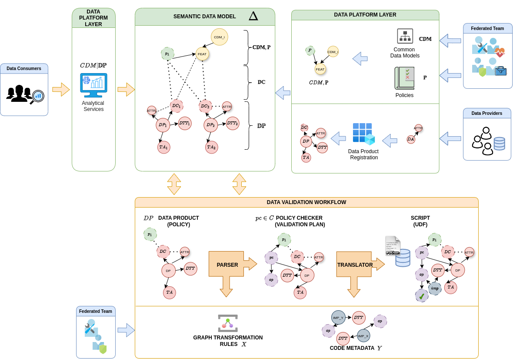

# Data Validation Framework

A federated framework for automating data validation in data spaces. This repository presents a simple prototype with the artefacts and code,

## Overview

The approach is build upon a federated architectural framework and encompasses the following layers:
- **Data Product Layer**: Contains data products and their infrastructure extensions (e.g., connectors).
- **Data Platform Layer**}: Functions as a central gateway for data management processes, including data asset registration and analytical studies.
- **Federated Computational Governance Layer**: Establishes guidelines and artifacts for data product management and governance.

## Prototype Folders and Files

- **Federated Computational Governance**
  - Computational Catalogues
    - pX.json: Policies in JSON-LD
  - Global Definitions
    - common_data_models.json: Common Data Models in JSON-LD
  - FederatedTeam
    - tbox.ttl: Terminology Box of the framework
  - SemanticDataModel
    - sdm.ttl: Semantic Data Model with Federation Metadata

- **Data Product Layer**
  - Data Product (CSV with Patient Demographics)
  - Data Product 2 (DICOM Image)
  - Data Product 2 (ML Model)

- **Data Platform Layer**
  - Registration
    - profiler.ipynb: Script to extract metadata from data products
  - Integrator
    - integrator.ipynb: Script to integrate data products
    - dpX.json: Data Product mappings and agreed Policies

- **Connector**
  - ValidationFramework
    - parser
      - parser.ipynb: Script to generate Policy Checkers
      - rules: SPARQL Construct rules for Graph Tranformation
    - translator
      - translator.ipynb: Script to translate Policy Checkers to UDF
      - code_metadata.json: Code metadata in JSON-LD
    - experiments
      - ecoystem: Ecoystem simulation
      - transforming_bottleneck: Framework comparison vs transforming to RDF
      - policy_times: Measuring policy processing times

## Getting Started

1. Clone the repository
2. Install required dependencies using `pip install -r requirements.txt`
3. run demo.ipynb in the demo folder to see the prototype components in action

## Key Features

- Policy-based data validation
- Support for multi-modal data
- Tracability and Transparency

## Future Work

- Support for more expressive policy patterns and use cases
- Integration and deployement within existing Data Space initiatives
- Optimizations and user-framework interaction interfaces

## Contributing
Guidelines for contributing to this project will be added soon.

## License

[License information to be added]

