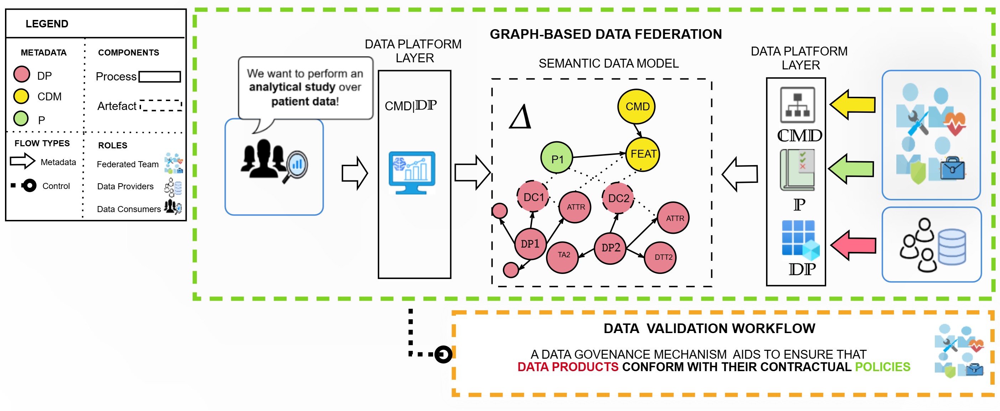

# Data Validation Worfklow

This repository contains a prototype workflow for automating data validation in data spaces. The workflow is derived from an architectural framework which uses knowledge graphs as basis for automation. 

## Architectural Framework Overview

The approach is build upon a federated architectural framework and encompasses the following layers:
- **Data Product Layer**: Contains data products and their infrastructure extensions (e.g., connectors).
- **Data Platform Layer**}: Functions as a central gateway for data management processes, including data asset registration and analytical studies.
- **Federated Computational Governance Layer**: Establishes guidelines and artifacts for data product management and governance.

The Federated Computational Governance Layer is particularly significant, as it is managed by a **federated team** acting as a federator. This team maintains all platform and governance functionalities, thus it is the point of extension for introducing data validation mechanisms to federated data spaces. Central to this layer is a Semantic Data Model, which serves as a backbone by capturing system metadata in a graph-based structure. Intuitively, SDM contains all the annotations needed to automate processes within the federation.

## Data Validation Workflow

The data validation workflow starts with a data consumer initiating an analytical service over SDM. The consumer’s
request is further sent to the data validation workflow, which ensures that the data
used for the specific analytical service is valid and complies with the agreed P. The
workflow ends by annotating data validation reports within ∆. MR1
The workflow is managed by the federated team, which provides graph trans-
formation rules (X) for generating data validation plans, and code metadata (Y)
for generating executable UDFs. The domain expertise of the federated team
ensures accurate policy interpretation and implementation of validation algorithms
in accordance with current regulations and standards.
The workflow goes through the two main components of the data validation
framework:

– **PLANNER**: This component processes each DP metadata, along with X, and
it generates a set of policy checkers (C), which serve as data validation plans. MR1
16

– **EXECUTOR**: This component accepts a policy checker (pc ∈ C) as input, and
uses Y to translate it into user-defined functions (UDFs) that can be executed
over data sources. After executing the UDF, it annotates pc with the validation
reports.

## Prototype Folders and Files

| Folder                           | File                                            | Description                                                         | Defined by     |
|----------------------------------|-------------------------------------------------|---------------------------------------------------------------------|:---------------|
| **FRAMEWORK**                        |                                                 |                                                                     |                |
| FederatedComputationalGovernance | ComputationalCatalogues/p*.json                 | Federation defined Policies in JSON-LD                              | Federated Team |
| FederatedComputationalGovernance | ComputationalCatalogues/common_data_models.json | Common Data Models in JSON-LD                                       | Federated Team |
| FederatedComputationalGovernance | FederatedTeam/tbox.ttl                          | Terminology Box for Semantic Data Model                             | Federated Team |
| FederatedComputationalGovernance | SemanticDataModel/sdm.ttl                       | Semantic Data Model with all annotations                            | Federated Team |
| DataProductLayer                 | DataProduct1                                    | CSV with Patient Demographics                                       |                |
| DataProductLayer                 | DataProduct2                                    | DICOM Image                                                         |                |
| DataProductLayer                 | DataProduct3                                    | ML Model                                                            |                |
| DataPlatformLayer                | Registration/profiler.ipynb                     | Notebook to automate boostraping of data sources                    |                |
| DataPlatformLayer                | Registration/integrator.ipynb                   | Notebook to generate mappings from DataProducts to CommonDataModels |                |
| DataPlatformLayer                | Registration/dpX.json                           | Data Products integrated with Data Contracts                        |                |
| **WORKFLOW**                         |                                                 |                                                                     |                |
| Connector                        | parser/planner.ipynb                            | Planner implementation                                              |                |
| Connector                        | parser/rules                                    | Graph Transformation Rules as SPARQL CONSTRUCT queries              |                |
| Connector                        | translator/executor.ipynb                       | Executor implementation                                             |                |
| Connector                        | translator/code_metadata.json                   | Code metadata in JSON-LD                                            |                |
| Connector                        | experiments/policy_times                        | Measure processing times                                            |                |
| Connector                        | experiments/transforming_bottleneck             | Workflow vs RDFValidation                                           |                |
| Connector                        | experiments/ecosystem                           | Measure parsing scalability                                         |                |

## Reproduce workflow

1. Clone the repository
2. Install required dependencies using `pip install -r requirements.txt`
3. run **demo.ipynb** in the demo folder to see the prototype workflow in action

## Reproduce (TP6 - Efficiency) Experiments

1. Clone the repository
2. Install required dependencies using `pip install -r requirements.txt`
3. Connector/ValidationFramework/experiments contains three subfolders with scripts to reproduce the results

## Key Features
- Policy-based data validationg
- Support for multi-modal data
- Tracability and Transparency

## Future Work

- Support for more expressive policy patterns and use cases
- Integration and deployement within existing Data Space components (e.g., Eclipse DataSpace Components)
- Optimizations and user-framework interaction interfaces

