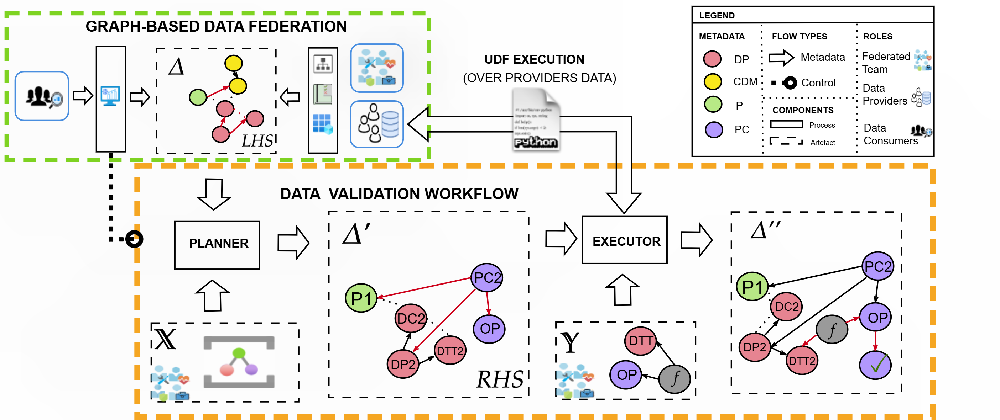

# Data Validation Worfklow

This repository contains a prototype workflow for automating data validation in federated data spaces. The framework addresses the challenge of ensuring data quality and compliance across distributed data environments where multiple organizations share data products while maintaining autonomy over their data governance.

## Problem Statement
In federated data spaces, organizations need to validate data quality and policy compliance across heterogeneous data sources. Current approaches fall short with:

- Policy Semantics: Interpreting Open Vocabularies such as Open Digitals Rights Language (ODRL)
- Data Syntactics: Adapting to Multi-modal data types (CSV, DICOM, ML models)
- Transparency & Tracability: Need to describe what, how and who performed data validation to promote trust.

## Architectural Framework Overview


Our approach uses knowledge graphs as the foundation for automated data validation, enabling policy-driven validation across federated environments while preserving data sovereignty.

The approach is build upon a federated architectural framework and encompasses the following layers:
- **Data Product Layer**: Contains data products and their infrastructure extensions (e.g., connectors).
- **Data Platform Layer**}: Functions as a central gateway for data management processes, including data asset registration and analytical studies.
- **Federated Computational Governance Layer**: Establishes guidelines and artifacts for data product management and governance.


### Semantic Data Model (SDM)
Central to the Federated Computational Governance Layer is the Semantic Data Model - a graph-based structure that captures system metadata and annotations needed to automate validation processes. The SDM serves as the backbone for policy interpretation and validation rule generation.

## Data Validation Workflow




The validation workflow operates through two main phases:

2. Planning Phase (PLANNER)

Processes data product metadata along with graph transformation rules
Generates policy checkers that serve as data validation plans
Ensures validation plans align with federated governance policies

2. Execution Phase (EXECUTOR)

Translates policy checkers into executable User-Defined Functions (UDFs)
Executes validation logic over data sources
Generates validation reports and annotations

### Workflow Steps

1. Data consumer initiates an analytical service request
2. Request is processed through the validation workflow
3. PLANNER generates appropriate validation plans based on policies and data product metadata
4. EXECUTOR translates plans into executable code
5. Validation results are annotated with SDM and can be queried


## Key Features
- Policy-based data validationg
- Support for multi-modal data
- Tracability and Transparency


## Prototype Folders and Files

| Folder                           | File                                            | Description                                                                                 |
|----------------------------------|-------------------------------------------------|---------------------------------------------------------------------------------------------|
| **FRAMEWORK**                        |                                                 |                                                                                             |
| FederatedComputationalGovernance | ComputationalCatalogues/p*.json                 | Federation defined Policies in JSON-LD                                                      |
| FederatedComputationalGovernance | ComputationalCatalogues/common_data_models.json | Common Data Models in JSON-LD                                                               |
| FederatedComputationalGovernance | FederatedTeam/tbox.ttl                          | Terminology Box for Semantic Data Model                                                     |
| FederatedComputationalGovernance | SemanticDataModel/sdm.ttl                       | Semantic Data Model with all annotations                                                    |
| DataProductLayer                 | DataProduct1                                    | CSV with Patient Demographics [(Bakas et al. 2021)](https://doi.org/10.7937/TCIA.709X-DN49) |
| DataProductLayer                 | DataProduct2                                    | DICOM Image  [(Bakas et al. 2021)](https://doi.org/10.7937/TCIA.709X-DN49)                  |
| DataProductLayer                 | DataProduct3                                    | ML Model (manually trained from Data Product 1)                                             |
| DataPlatformLayer                | Registration/profiler.ipynb                     | Notebook to automate boostraping of data sources                                            |
| DataPlatformLayer                | Registration/integrator.ipynb                   | Notebook to generate mappings from DataProducts to CommonDataModels                         |
| DataPlatformLayer                | Registration/dpX.json                           | Data Products integrated with Data Contracts                                                |
| **WORKFLOW**                         |                                                 |                                                                                             |
| Connector                        | parser/planner.ipynb                            | Planner implementation                                            ls<br/>                        |
| Connector                        | parser/rules                                    | Graph Transformation Rules as SPARQL CONSTRUCT queries                                      |
| Connector                        | translator/executor.ipynb                       | Executor implementation                                                                     |
| Connector                        | translator/code_metadata.json                   | Code metadata in JSON-LD                                                                    |
| Connector                        | experiments/policy_times                        | Measure processing times                                                                    |
| Connector                        | experiments/transforming_bottleneck             | Workflow vs RDFValidation                                                                   |
| Connector                        | experiments/ecosystem                           | Measure parsing scalability                                                                 |


## Quick-Start Instructions

### Prerequisites

- Python 3.8+
- RDF processing libraries (rdflib, SPARQLWrapper)
- Jupyter Notebook environment
- Basic understanding of semantic web technologies

To reproduce the framework and workflow, you can follow these steps:

1. Clone the repository
2. Install required dependencies using `pip install -r requirements.txt`

### Reproduce workflow

Running the Complete Workflow
The **demo.ipynb** notebook in the demo folder provides a complete walkthrough of the validation workflow, including:

- Federation Metadata population (Registration of Data Products, Common Data Models and Policies)
- Policy Checker Generation (Planner)
- Dynamic Data Validation Code Generation (Executor)
- Example Validation Reports and Tracability Queries


### Reproduce (TP6 - Efficiency) Experiments

Efficiency experiment scripts can be found in **Connector/ValidationFramework/experiments** contains three subfolders with scripts to reproduce the results

## Extensions

To extend the framework with new data validation use cases, you will need to provide:

1. Add a new Graph transformation rule in the Connector/ValidationFramework/planner/rules folder as SPARQL CONSTRUCT queries

Example Graph Transformation Rule: 
```sparql
PREFIX odrl: <http://www.w3.org/ns/odrl/2/>
PREFIX tb: <http://www.semanticweb.org/acraf/ontologies/2024/healthmesh/tbox#>
PREFIX ab: <http://www.semanticweb.org/acraf/ontologies/2024/healthmesh/abox#>
PREFIX rdfs: <http://www.w3.org/2000/01/rdf-schema#>

CONSTRUCT {
    <{op_uri}> a tb:Operation;
        tb:hasAbstract ab:LoadData;
        tb:hasOutput ab:data;
        tb:hasInput ?param.
    <{pc}> tb:nextStep <{op_uri}>.
}
WHERE {
    <{dp}> tb:hasTA ?ta .
    ?ta tb:typeAcces ?access .
    ?access rdfs:label ?label ;
    tb:path ?path .
    FILTER(?label = ab:Static)
    BIND(?path AS ?param)
}
```


2. Add code metadata instance in Connector/ValidationFramework/executor/code_metadata.json

Example Code Metadata Instance in JSON-LD
```sparql
   {
      "@id": "ab:Imp1",
      "@type": "tb:Implementation",
      "tb:hasCode": [
        {
          "@id": "ab:Imp1Code",
          "@type": "tb:Code",
          "tb:code": "pandas.read_csv(p)"
        }
      ],
      "tb:hasParameters": [
          {
            "@id": "ab:Imp1CodeParam1",
            "@type": "tb:Parameter",
            "tb:name": "p",
            "tb:type": "str"
          }
      ],
        "tb:dependsOn": [
          {
            "@id": "ab:Imp1CodeDep1",
            "tb:name": "pandas",
            "@type": "tb:Library"
          }
        ],
        "tb:forOp": [
          {
            "@id": "ab:LoadData",
            "@type": "tb:Operation"
          }
        ],
        "tb:forType": [
          {
            "@id": "ab:Tabular",
            "@type": "tb:DatasetTypeTemplate"
          }
        ],
      "tb:returns": "pandas.DataFrame"
    },
```
For best practices we recommend:

- Use standard vocabularies (DCAT, DQV, etc.) for better interoperability
- Follow semantic web principles for policy definitions
- Ensure validation logic is deterministic and reproducible


## Future Work

- Support for more expressive policy patterns and use cases
- Integration and deployement within existing Data Space components (e.g., Eclipse DataSpace Components)
- Optimizations and user-framework interaction interfaces


